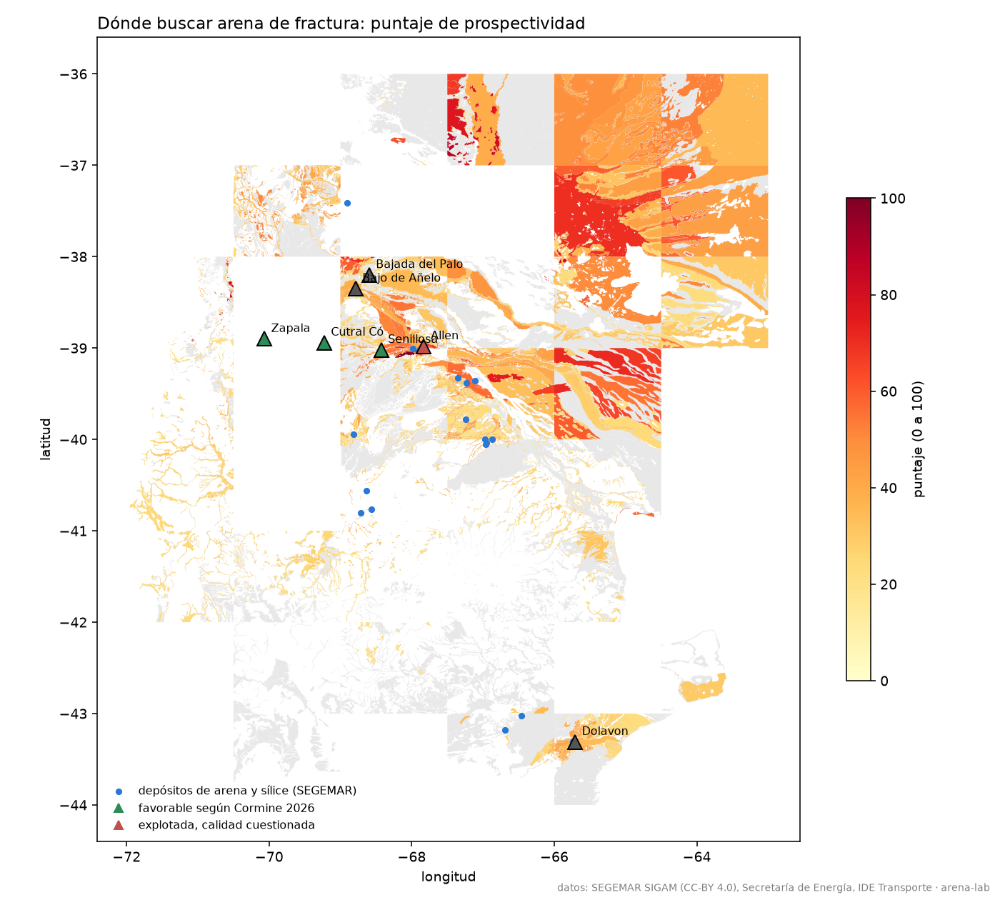
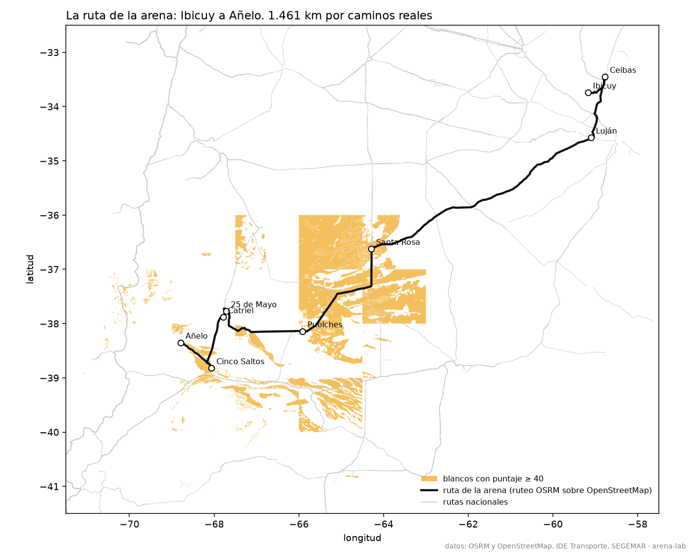
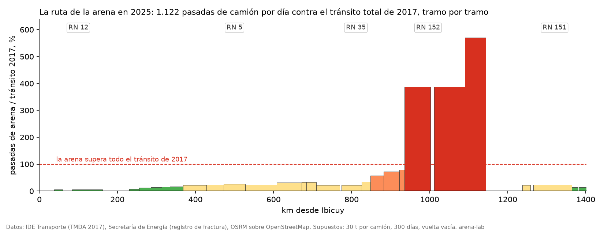
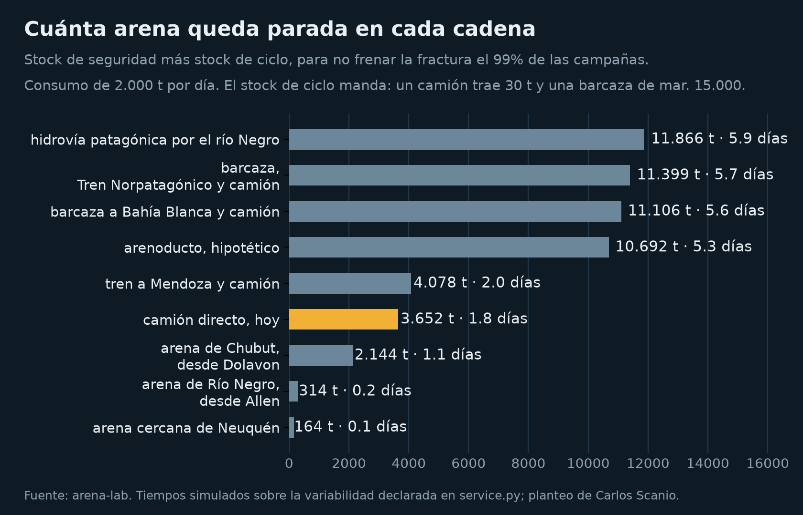

# arena-lab

Dónde buscar arena de fractura para Vaca Muerta, con datos abiertos. Séptimo
repo de la serie de Machine Learning aplicado a hidrocarburos y el primero de
minería: el mapa geológico 1:250.000 de SEGEMAR, clasificado con reglas
explícitas, ponderado por distancia al consumo y a las rutas, y controlado
contra los lugares donde la industria ya dijo que hay arena buena o mala.

> Vaca Muerta bombea más de cinco millones de toneladas de arena por año y las
> trae en camión desde Entre Ríos, a 1.400 km, porque la arena cercana de Río
> Negro no aguantó la presión. Neuquén explora la suya con 104 pedidos de
> cateo. Este repo hace lo que hace un geólogo antes de salir al campo: mirar
> el mapa y decidir dónde muestrear primero.



El mapa interactivo, para recorrer los blancos, los depósitos conocidos, las
rutas y las áreas donde se bombea: <https://dpinero14.github.io/arena-lab/mapa_arena.html>

Y la ruta de la arena animada, año a año desde 2012: los camiones aparecen
sobre la traza en proporción a la arena bombeada, con el flete del año, las
ocho cadenas alternativas y cada tramo de ruta pintado según cuánto pesa la
arena en su tránsito: <https://dpinero14.github.io/arena-lab/ruta_animada.html>

Y el laboratorio, para mover la demanda, la carga por camión y el reparto por
cadena y ver qué pasa con el costo, los camiones, cada tramo de ruta, el
desgaste y las emisiones: <https://dpinero14.github.io/arena-lab/laboratorio_arena.html>

## Qué hace

| Notebook | Qué hace |
|---|---|
| `01_donde_buscar_arena` | Baja y clasifica 21.546 polígonos del mapa geológico en cinco clases de blanco. Calcula un puntaje de 0 a 100 por polígono con la geología, la distancia al centro de la demanda, a la red vial y a los depósitos de arena conocidos. Lista los mejores blancos. Controla el puntaje en siete lugares con arena conocida. Traza la ruta real de los camiones de Ibicuy a Añelo y mide qué blancos quedan al costado. Dibuja el mapa. |
| `02_la_logistica_de_la_arena` | Mide la cadena de hoy año a año: viajes, camiones, flete y dólares por kilómetro. Compara nueve cadenas con las mismas reglas, un arenoducto hipotético incluido: costo por tonelada, kilómetros en camión y emisiones. Corre escenarios de 5, 8 y 15 millones de toneladas con ahorro y repago del tren. Compara con Estados Unidos, Canadá y Rusia. Genera la ruta animada con capas y selector de cadena. |
| `03_la_ruta_paga_el_pozo` | Parte la ruta en tramos con el tránsito medio diario de 2017 de IDE Transporte y cuenta, año a año, las pasadas de camiones de arena contra todo el tránsito que cada tramo tenía. Convierte pasadas en desgaste con la ley de la cuarta potencia. Mide cada cadena en camiones que dejan de pasar. Genera el laboratorio con perillas. |
| `04_la_cadena_que_no_se_corta` | Simula el tiempo de entrega de cada cadena con la variabilidad real del camión y una demora con cola derecha por transbordo. Calcula el stock de seguridad y el de ciclo que hacen falta para no frenar una fractura con 95, 98 y 99 % de probabilidad, lo que cuesta ese stock y lo que costaría el equipo parado. Rehace el ranking con el servicio adentro. |

Las reglas y los pesos están en `src/alab/targets.py` y `src/alab/score.py`,
en un solo lugar cada uno, para que se puedan leer y discutir. Todo está
testeado con polígonos sintéticos; el notebook narra.

## Qué encontramos

**La ventana tiene 143.000 km² con algún interés, y casi toda la arena eólica
está en La Pampa.** De los 21.546 polígonos, 436 son arena eólica cuaternaria
y suman 68.800 km², pero el 90 % de esa superficie es el manto arenoso de La
Pampa, las hojas Victorica, Santa Rosa, Darregueira y General Acha, a 250 o
400 km del consumo. A menos de 150 km del centro de la demanda hay 13
polígonos eólicos que suman 433 km². La arena cercana es escasa en el mapa,
no solo en las canteras.

| Clase de blanco | Polígonos | km² |
|---|---|---|
| Arena eólica cuaternaria | 436 | 68.819 |
| Arena fluvial cuaternaria | 3.142 | 52.990 |
| Arenisca antigua | 2.405 | 22.911 |
| Otra con arena | 4.359 | 98.147 |
| Sin interés | 11.204 | 161.392 |

**El puntaje encuentra la arena que ya se conoce, incluida la mala.** En los
lugares donde la industria habló, el mejor polígono a 15 km queda arriba del
percentil 85 en todos los casos con cobertura: Senillosa, que Cormine dio por
favorable, en el 99; la cantera de Vista en Bajada del Palo, en el 98; Dolavon,
en el 88. Y Allen, la arena de Río Negro que las operadoras dejaron por rotura
y arcillas, sale con el puntaje máximo, 100. El mapa geológico dice dónde hay
médanos, no si sus granos aguantan la presión de confinamiento. Ese es el
límite del método y acá está medido, no anunciado.

| Lugar | Qué se sabe | Mejor puntaje a 15 km | Clase | Percentil |
|---|---|---|---|---|
| Senillosa | favorable, Cormine 2026 | 70 | fluvial cuaternaria | 99 |
| Bajada del Palo | cantera de Vista | 60 | eólica cuaternaria | 98 |
| Dolavon | planta pionera | 43 | fluvial cuaternaria | 88 |
| Bajo de Añelo | en estudio | 41 | fluvial cuaternaria | 86 |
| Allen | explotada, calidad cuestionada | 100 | eólica cuaternaria | 100 |
| Cutral Có | favorable, Cormine 2026 | sin cobertura | | |
| Zapala | favorable, Cormine 2026 | sin cobertura | | |

**Hay un hueco de 39.000 km² en la cartografía, y es el que más importa.** El
SIGAM no tiene publicadas las hojas 1:250.000 entre Zapala y Piedra del
Águila: un rectángulo de 130 por 330 km con cobertura cero. El corredor Cutral
Có a Zapala, donde Cormine obtuvo resultados positivos, cae adentro. Con datos
públicos no se puede decir nada de esa zona, y eso también es un resultado.

**Cerca del consumo, los blancos son los médanos del Bajo de Añelo y las
terrazas de los ríos.** A menos de 150 km, los mejores puntajes son los
"depósitos de médanos longitudinales" del Bajo de Añelo, 89 km² a 28 km del
centro de la demanda, y las terrazas fluviales antiguas de los ríos Neuquén,
Limay y Negro, entre Senillosa y General Roca. El Bajo de Añelo es una de las
tres zonas que Neuquén explora. Su puntaje pierde por la distancia a rutas
nacionales, 68 km, porque la red vial usada no tiene las rutas provinciales.

**La ruta de la arena cruza un mar de arena.** El recorrido real de los
camiones, de Ibicuy a Añelo por la RN 12, la RN 5, la RN 35, la RN 152, la RP
20 y la RN 151, calculado con un ruteador abierto sobre OpenStreetMap, mide
1.461 km, contra los 1.474 que cita la prensa, y 20 horas de manejo continuo.
Entre Santa Rosa y Puelches atraviesa el manto arenoso de La Pampa: a menos de
15 km de la traza hay 83 polígonos de arena eólica cuaternaria, 19.800 km², en
las hojas Santa Rosa y General Acha, con puntajes de hasta 75. Los camiones
que traen arena desde 1.400 km pasan por encima de arena durante 300 km. Que
esa arena sirva o no, lo dice el laboratorio; que nadie la haya ensayado en
público, lo dice este mapa.



**En camiones y en dólares, año a año.** Con 30 toneladas por viaje, 300 días
operativos y un ciclo de seis días, la arena nacional de 2025 son 168.000
viajes cargados, 561 por día y unos 3.400 camiones en circulación, contra los
4.300 que cuenta la prensa contando los parados. A 70 dólares la tonelada de
flete, a precios de 2026, son 354 millones de dólares en el año: 242.000
dólares por cada kilómetro de ruta. Desde 2012, 1.460 millones. Cada viaje
cargado cuesta 2.100 dólares de flete, 1,44 por kilómetro. Los supuestos están
en `animation.py` y en la página animada, que además supone toda la arena
nacional por la ruta de Entre Ríos: hasta 2020 una parte venía de Río Negro y
Chubut, con viajes más cortos.

## La ruta paga el pozo

El costo de la arena que se publica, 97 dólares por tonelada hasta el pozo,
no incluye la ruta. IDE Transporte publica el tránsito medio diario de 2017
por tramo de ruta nacional, el último por tramo; el registro de fractura da
las toneladas por año; con 30 toneladas por viaje, 300 días y la vuelta
vacía, cada tonelada se convierte en pasadas de camión por cada tramo.

**En la RN 152 pasan más camiones de arena que vehículos había en 2017.** En
2025 son 1.122 pasadas por día. Entre General Acha y Casa de Piedra hay dos
tramos que en 2017 tenían 197 y 290 vehículos por día, autos incluidos: la
arena sola es cuatro a seis veces todo ese tránsito. Desde 2021, 198 km de la
RN 152 tienen más camiones de arena por día que tránsito total tenían en
2017; el primer tramo se pasó en 2018. En la RN 5 y la RN 35 la arena pesa
entre el 7 y el 34 % del tránsito de 2017; en la RN 151, entre el 14 y el
23 %.

| Ruta | km medidos | Tránsito 2017, veh/día | Pasadas de arena 2025 | % del tránsito 2017 |
|---|---|---|---|---|
| RN 12 | 100 | 19.700 | 1.122 | 6 |
| RN 5 | 540 | 3.350 a 15.560 | 1.122 | 7 a 34 |
| RN 35 | 74 | 3.266 a 5.200 | 1.122 | 22 a 34 |
| RN 152 | 286 | 197 a 1.960 | 1.122 | 57 a 570 |
| RN 151 | 154 | 4.900 a 7.950 | 1.122 | 14 a 23 |



El modelo no usa la prensa y da 1.122 pasadas diarias. La Pampa cuenta 1.200
camiones por día para fundamentar una tasa vial, y en Puelches dicen que la
RN 152 pasó de 200 o 300 camiones a entre 800 y 1.200. Coinciden.

**Cada camión que pasa desgasta como 10.000 autos.** El AASHO Road Test midió
que el daño al pavimento crece con la cuarta potencia de la carga por eje.
Con la Guía AASHTO 1993, un semirremolque de cinco ejes y 36 toneladas son
4,26 ejes equivalentes por pasada y un auto 0,0004: 10.650 autos por camión.
Las 1.122 pasadas de 2025 desgastan cada tramo como 12 millones de autos por
día. Los camiones de la arena pesan 53 a 55 toneladas y los bitrenes 75, así
que es un piso. Con 8 millones de toneladas, la cifra de 2027, serían 1.778
pasadas: nueve veces el tránsito de 2017 en el peor tramo.

**Las cadenas, medidas en camiones que dejan de pasar.** El tren y la hidrovía
sacan de la ruta larga a todos; la barcaza con camión los saca de la RN 5 y la
RN 152 y los pone en la RN 22, que cerca de Neuquén ya tenía tránsito alto.
Del otro lado, lo anunciado en 2026 para toda la ruta: bacheo y concesión con
peaje en Entre Ríos, tasa vial en La Pampa, 305 km concesionados en Río Negro
con 60 millones de dólares, la RN 5 concesionada sin obras de ampliación y el
bypass de Añelo. Del orden de 100 millones de dólares, una vez, contra 354
millones por año de flete.

## La logística de la arena: nueve caminos con las mismas reglas

Cada cadena es una lista de tramos con su modo y sus kilómetros, más un costo
por tonelada puesta en el pozo tomado de fuentes de 2026, y las emisiones con
los factores europeos de 2018 pozo a rueda, los únicos con método comparable
para camión, tren, río y mar. Todo declarado en `src/alab/logistics.py`.

| Cadena | USD por tonelada al pozo | km en camión | kg CO₂e por tonelada | Estado |
|---|---|---|---|---|
| Camión directo, hoy | 97 | 1.461 | 200 | existe: 4.300 camiones, 70 a 75 h por tramo |
| Barcaza a Bahía Blanca y camión | 63 | 620 | 100 | en construcción: terminal de PTP en Ibicuy, 12 MUSD |
| Barcaza, Tren Norpatagónico y camión | 35 | 50 | 38 | no existe: el tren mueve menos de 100.000 t, 37 % de la vía en buen estado, faltan 83 km |
| Hidrovía patagónica por el río Negro | 48 | 50 | 48 | en estudio: dragado, terminales y cabotaje pendientes |
| Tren a Mendoza y camión | 84 | 748 | 124 | existió: YPF y Trenes Argentinos Cargas, 10.000 t por mes desde 2021 |
| Arena de Río Negro, desde Allen | 33 | 120 | 16 | existe y se recupera: 1,5 Mt en 2025 tras caer 42,6 % |
| Arena de Chubut, desde Dolavon | 68 | 855 | 117 | existe, chica: Arenas Patagónicas fue pionera |
| Arena cercana de Neuquén | 30 | 60 | 8 | en prueba: 20.000 t por mes, calidad por confirmar |
| Arenoducto, hipotético | 69 a 5 Mt, 62 a 8 Mt | 50 | 33 | no existe: pulpa por caño, supuestos declarados abajo |

**El arenoducto: mover la arena como pulpa por un caño.** No es ciencia
ficción, es un mineraloducto: Minas-Rio lleva 26,5 millones de toneladas de
hierro por año a lo largo de 529 km en Brasil; OCP mueve fosfato 187 km en
Marruecos con 400 millones de euros de inversión y 90 % menos de costo de
transporte; Alumbrera operó 316 km entre Catamarca y Tucumán de 1997 a 2018;
la Unión Soviética movió piedra en cápsulas neumáticas por un tubo de 49 km
en 1980; y el Dune Express lleva 13 millones de toneladas de arena de
fractura por año en una cinta cerrada de 68 km en el Permian. Nadie publicó
un precio para uno de arena a 1.100 km, así que los supuestos están en
`ARENODUCTO`, en `logistics.py`: traza por el cruce de Zárate, el corredor de
la RN 5 y la traza del gasoducto Perito Moreno de Salliqueló a Tratayén;
2.000 millones de dólares de capex al costo por km de OCP, amortizados a 20
años sin interés en lo que se bombea; 0,02 dólares por tonelada-km de
operación; media tonelada de agua por tonelada de arena, 2,5 hm³ por año a 5
millones de toneladas; y el factor de emisión del tren como cota para el
bombeo. A 5 millones de toneladas da 69 dólares por tonelada y repaga en 14
años; a 8, 62 dólares y 7 años. Con el capex por km del gasoducto serían
4.400 millones y 93 dólares, casi el camión. A esta distancia pierde con el
tren; ganaría con arena a 100 km, que es exactamente lo que hizo el Permian.
La pulpa llega húmeda, y en el Permian ya se bombea arena húmeda sin secar,
con 5 a 10 dólares menos por tonelada y mucho menos polvo de sílice.

**Con 5 millones de toneladas, la diferencia entre el camión y el tren son
309 millones de dólares por año.** El tren pagaría sus 500 millones en menos
de dos años si pudiera llevarlo todo; con la capacidad de 1,5 millones que se
le atribuye al primer año, el ahorro baja a 93 millones y el repago a cinco
años y medio. A 8 millones de toneladas, la cifra que se proyecta para 2027,
el camión directo cuesta 776 millones por año y pone 5.300 camiones en la
ruta. Las emisiones del camión son 1.000 kilotoneladas de CO₂e por año a 5
millones; el tren las baja a 190.

**Cómo lo resolvieron otros.** Estados Unidos pasó por dos etapas en diez
años: arena de calidad a 2.000 km en tren, con la logística en tres cuartos
del precio, y después arena regional a 50 km y una cinta transportadora de 68
km. Canadá mezcla arena importada por tren con local sin tren. Rusia no tiene
arena apta, usa cerámica y la lleva en tren a depósitos que carga antes del
invierno. Argentina está en la primera etapa con el modo equivocado: la misma
proporción de logística en el precio que tenía Estados Unidos, pero en camión.

La ruta animada, versión 2, con los blancos de arena debajo de la traza, el
ferrocarril y su estado, los ríos, los puertos y un selector de cadena que
cambia las unidades que circulan, el costo y las emisiones de cada año:
<https://dpinero14.github.io/arena-lab/ruta_animada.html>

## Cómo se explora arena de fractura, en dos párrafos

La arena que sirve es cuarzosa, redonda y resistente. La norma API 19C pide
esfericidad y redondez de 0,6 o más, menos del 10 % de finos al comprimir a la
presión de ensayo, solubilidad en ácido menor al 2 o 3 %, turbidez menor a 250
FTU y sílice alta. Eso lo dan, sobre todo, las arenas eólicas: el viento
selecciona el tamaño y redondea los granos. Después las fluviales, con más
gravas y finos que separar. Y algunas areniscas poco cementadas, que hay que
moler.

Por eso las reglas de `targets.py` leen la génesis, la litología y la edad de
cada unidad: eólico y cuaternario puntúa más que fluvial, que puntúa más que
arenisca antigua; mencionar cuarzo suma, mencionar limos o gravas resta, lo
volcánico queda afuera. El resto es geografía: cuán lejos del consumo, cuán
lejos de un camino, cuán cerca de una cantera que ya existe.

## Cómo correrlo

Requiere Python 3.11 o superior.

```bash
git clone https://github.com/dpinero14/arena-lab.git
cd arena-lab
make setup                          # venv, geopandas, folium, kernel de Jupyter
make test                           # pytest, con polígonos sintéticos
make data                           # ~320 MB: SEGEMAR por WFS, rutas, registro de fractura y producción
make notebooks                      # unos 10 minutos
```

En Windows sin GNU make: `scripts\setup.ps1`, `scripts\test.ps1`,
`python scripts\download_data.py`, `scripts\notebooks.ps1`.

## Estructura

```
src/alab/
  segemar.py     descarga por WFS con paginado, GeoParquet
  targets.py     reglas geológicas: clase de blanco y banderas por polígono
  score.py       puntaje de prospectividad con pesos declarados
  validate.py    control contra lugares con arena conocida
  demand.py      arena bombeada por área, con coordenadas de pozo
  route.py       la ruta de la arena de Ibicuy a Añelo, por OSRM, con puntos de paso de la prensa
  animation.py   la ruta animada v1: camiones por año y flete por kilómetro, con supuestos declarados
  logistics.py   cadenas alternativas: tramos, costos por tonelada, capex repartido en el volumen, emisiones, escenarios y benchmarks
  animation2.py  la ruta animada v2: capas, selector de cadena, contexto por año, presión por tramo y cierre
  roads.py       la ruta por tramos: tránsito 2017, pasadas de arena por día, cuarta potencia
  service.py     tiempos simulados, stock de seguridad y de ciclo, nivel de servicio y ranking con servicio
  lab.py         el laboratorio con perillas: demanda, carga por camión y reparto por cadena
  maps.py        mapa interactivo (folium) y figuras
notebooks/       01_donde_buscar_arena, 02_la_logistica_de_la_arena, 03_la_ruta_paga_el_pozo
tests/           pytest con polígonos y tramos sintéticos
docs/            mapa_arena.html, ruta_animada.html, laboratorio_arena.html y figuras
data/raw/        vacío y en .gitignore; ver data/README.md
```

## La cadena que no se corta

El costo por tonelada no decide solo. Lo planteó Carlos Scanio en los
comentarios: cada transbordo suma manipuleo, espera y stock de seguridad, y
una fractura que se queda sin arena frena la operación completa. El notebook
04 lo modela con sus reglas: nivel de servicio como probabilidad de no faltar
en la campaña, demanda por campaña y no por promedio diario, y variabilidad
calibrada con las 70 a 75 horas reales del camión.

| Cadena | Días de entrega, mediana | Desvío, días | Stock para el 99 % | Días de consumo |
|---|---|---|---|---|
| Arena cercana de Neuquén | 0,1 | 0,03 | 164 t | 0,1 |
| Arena de Río Negro, desde Allen | 0,2 | 0,06 | 314 t | 0,2 |
| Arena de Chubut, desde Dolavon | 1,8 | 0,46 | 2.144 t | 1,1 |
| Camión directo, hoy | 3,0 | 0,78 | 3.652 t | 1,8 |
| Tren a Mendoza y camión | 4,4 | 0,66 | 4.078 t | 2,0 |
| Barcaza a Bahía Blanca y camión | 5,9 | 0,78 | 11.106 t | 5,6 |
| Barcaza, Tren Norpatagónico y camión | 6,9 | 0,84 | 11.399 t | 5,7 |
| Hidrovía patagónica por el río Negro | 8,5 | 0,94 | 11.866 t | 5,9 |



**El ranking no cambia, y la razón es que la arena es barata.** Tener el stock
que hace falta cuesta entre 1 y 65 centavos por tonelada, y las paradas
esperadas, entre 5 y 25 centavos, contra diferencias de flete de decenas de
dólares. Con un insumo caro por tonelada, el mismo modelo daría otra cosa.

**Lo que sí cambia es cuánta arena hay que tener parada.** Las cadenas por
agua necesitan unas 11.000 toneladas entre stock de seguridad y stock de
ciclo, tres veces el camión directo, porque lo que llega junto es una barcaza
de 15.000 toneladas y no una camionada de 30. Eso son silos, playas de acopio
y movimiento: no aparece en ningún dólar por tonelada de flete, pero hay que
construirlo antes de que la cadena funcione.

**Y conviene subir el nivel de servicio, no bajarlo.** Pasar de 95 a 99 %
suma centavos de stock y ahorra más en paradas evitadas: el costo total baja
en todas las cadenas. Es la asimetría que marcó Carlos, medida: un día de
flota de fractura parada, con los supuestos declarados, equivale a 6.800
toneladas de arena en cantera.

Los supuestos que faltan confirmar con operación real están declarados en
`src/alab/service.py`: consumo de campaña, costo del día parado y duración de
una parada.

## Lo que me corrigieron

Tres cadenas y una corrección de equipo salieron de los comentarios al post
del 17 de septiembre de 2026, y están incorporadas con crédito:

- **Matías Derlich**, ingeniero mecánico: faltaba el tren a Mendoza. En agosto
  de 2021 YPF acordó con Trenes Argentinos Cargas llevar arena de San Nicolás
  a Palmira por la línea San Martín, 10.000 t por mes, y de ahí en camión a
  Neuquén. También marcó las arenas de Río Negro y de Chubut.
- **Maximiliano San Martín**: hay arena cerca, en Neuquén y en Río Negro. Es
  cierto y ahora está medido: Allen queda a 120 km de Añelo y sale 33 dólares
  la tonelada contra 97 del camión desde Entre Ríos. La razón por la que
  perdió mercado en 2025 fue la calidad, no la distancia.
- **Alejandro Raúl García Arguijo**, profesor de la Universidad de la Marina
  Mercante: las barcazas de hidrovía son para ríos interiores; el tramo
  marítimo va con convoy de empuje o barcaza ATB, de 15.000 a 20.000 t contra
  1.500 de una fluvial. La animación ahora distingue los dos equipos.
- **Carlos Scanio**, gerente de operaciones y de supply chain: el costo por tonelada no decide solo.
  Cada transbordo suma manipuleo, espera y stock de seguridad, y una fractura
  que se queda sin arena frena la operación. El modelo compara promedios y no
  tiene esa variabilidad: queda declarado en las limitaciones y es el próximo
  paso más útil.
- **Diego Hernán Corona**, marinero de puente: el arenoducto choca con la
  física de la pulpa. Bombear arena existe, así descargan las dragas, pero a
  kilómetros: con granos de 0,1 a 0,6 mm hay que sostener de 3 a 5 m/s para
  que no sedimente. Es la misma conclusión a la que llega el modelo por el
  lado del costo.
- **Alberto Gianola Otamendi**, perito naval y autor de *El río Negro, su uso
  como vía navegable* (Boletín del Centro Naval 851, 2019): los 720 km del
  río, y la equivalencia de una barcaza cada tres trenes o 360 semirremolques.
- **Gonzalo Andrés Ferez**, ingeniero ambiental: los factores de emisión son
  europeos; falta una fuente argentina por modo.
- **Aldo Olcese Rodríguez**, gerente general en minería: faltaba el capital
  inmovilizado en tránsito, que en trayectos largos puede cambiar el orden de
  las alternativas. Ahora está calculado y declarado: con la arena a 22
  dólares la tonelada y un costo de capital del 15 % anual, el camión
  inmoviliza 3 centavos por tonelada en sus 2,9 días de viaje, y la cadena por
  agua y tren, 6 centavos en 6,7 días. Contra los 62 dólares que separan una
  de otra, no mueve el orden; con carga de alto valor por tonelada, sí lo
  movería. Está en `Chain.capital_transito_usd_t` y en la tabla de cadenas.
  Aun duplicando la espera por transbordo, sigue por debajo de 10 centavos.

## Limitaciones

- El mapa señala dónde buscar, no si la arena sirve. Esfericidad, redondez,
  rotura y turbidez salen del laboratorio, y no hay un solo ensayo argentino
  publicado como dato.
- Escala 1:250.000: un médano chico no aparece. La descripción de cada hoja
  la escribió un geólogo distinto con palabras distintas, y las reglas son de
  palabras clave.
- Faltan hojas en el SIGAM, y una de ellas es la que más importa.
- La red vial son rutas nacionales; las provinciales, como la RP 7 y la RP 17
  que llegan a Añelo, no están.
- Los pesos son una opinión declarada. Cambiarlos cambia el mapa.
- Los costos por tonelada de las cadenas vienen de tres fuentes con bases no
  idénticas, y las cadenas por agua todavía no tienen inversión estimada. Los
  factores de emisión son europeos de 2018; la flota argentina probablemente
  emite más. Las trazas de barcaza y tren son puntos de paso, no rutas exactas.
- El arenoducto es un experimento con supuestos declarados: el capex por km
  de un mineraloducto de fosfato en Marruecos, la operación de la literatura y
  el factor de emisión del tren como cota. Cambiar el capex cambia el
  veredicto, por eso van dos versiones.
- El modelo compara promedios: no simula variabilidad de tiempos, colas en los
  transbordos ni stock de seguridad. Es el límite que más podría cambiar el
  orden entre cadenas, y lo marcó un gerente de operaciones en los comentarios.
- Las tres cadenas nuevas van por rutas cuyo tránsito no está medido acá: los
  748 km de Palmira a Añelo, los 120 de Allen y los 855 de Dolavon no pasan
  por los tramos con TMDA que sí se miden en la ruta de Entre Ríos. Y el km de
  vía del tren a Mendoza se aproxima por la distancia carretera, que es menor.
- El tránsito por tramo es de 2017, el último publicado, e incluye a todos los
  vehículos; la comparación es contra ese total, no contra un tránsito "sin
  arena". Toda la arena nacional se supone por la ruta de Entre Ríos, cuando
  desde 2024 es el 75 %. Los tramos de IDE Transporte traen calzadas dobles
  y, en la RN 22, varios tramos superpuestos: se toma el de más tránsito, así
  que la presión sobre la RN 22 es un piso. Las rutas provinciales por donde
  también pasa la arena, RP 45, RP 20 y RP 7, no tienen tránsito publicado.

## Próximos pasos

1. La geoquímica de SEGEMAR, 13.946 muestras en la ventana, como proxy de
   pureza: aluminio, hierro y calcio bajos donde la arena es cuarzosa.
2. Los cateos de Neuquén, cuando se publiquen como datos, como segunda
   validación.
3. Un laboratorio casero de forma de grano: microscopio USB, arena de Ibicuy y
   de Río Negro, esfericidad y redondez por visión, contra la tabla de Krumbein.

## Datos y licencias

- SEGEMAR, SIGAM, mapa geológico 1:250.000, depósitos de minerales
  industriales y geoquímica: <https://sigam.segemar.gov.ar>, CC-BY 4.0, por WFS.
- IDE Transporte, tránsito medio diario de rutas nacionales 2017 por tramo:
  datos.gob.ar. Desgaste: American Trucking Associations, "Analysis of car and
  truck pavement impacts" (2022), sobre la Guía AASHTO 1993.
- Estado de las rutas y obras anunciadas: La Nación (Diego Cabot y Paula
  Urien) reproducido por Diario Neuquino, 11/9/2026; Más Energía, 7/9/2026;
  Diario Río Negro, 30/7/2026; La Arena, 9/5/2026.
- Ruta de la arena: traza calculada con OSRM sobre OpenStreetMap (ODbL), con
  los puntos de paso que describen Diario Neuquino y LM Neuquén en septiembre
  de 2026.
- Ferrocarril, estaciones y puertos: IDE Transporte, por WFS. Ríos: IGN,
  capa de aguas continentales perennes, por WFS.
- Costos de las cadenas: Infobae 15/8/2026, El Cronista 4/9/2026, GlobalPorts
  15/7/2026, Bloomberg Línea 11/9/2026. Arenoducto: Minas-Rio (Mining
  Technology), OCP Khouribga a Jorf Lasfar (Energy Efficiency Magazine
  1/2022, Paterson & Cooke), mineraloducto de Alumbrera (HCDN), cápsulas
  LILO-2 (historia de los capsule pipelines), gasoducto Perito Moreno
  (Wikipedia), wet sand (AOGR). Emisiones: CE Delft y Fraunhofer ISI
  para la Agencia Europea de Medio Ambiente, 2021, datos 2018.
- Secretaría de Energía, registro de fractura y producción no convencional:
  <https://datos.energia.gob.ar>, CC-BY 4.0.
- Lugares con arena conocida: prensa citada en `src/alab/validate.py`.
- Código: MIT.

## Autor

Diego Piñero. Data science en producción en logística, aprendiendo hidrocarburos
en público. Serie **Sur Analytics** de ML aplicado a Oil & Gas:
[well-log-lab](https://github.com/dpinero14/well-log-lab),
[well-pay-lab](https://github.com/dpinero14/well-pay-lab),
[vaca-muerta-lab](https://github.com/dpinero14/vaca-muerta-lab),
[oilgas-predictive-maintenance](https://github.com/dpinero14/oilgas-predictive-maintenance),
[reservoir-lab](https://github.com/dpinero14/reservoir-lab) y este.
